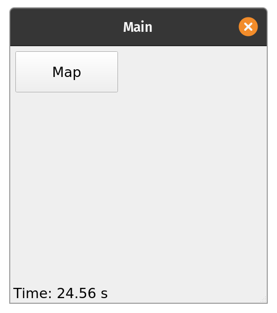
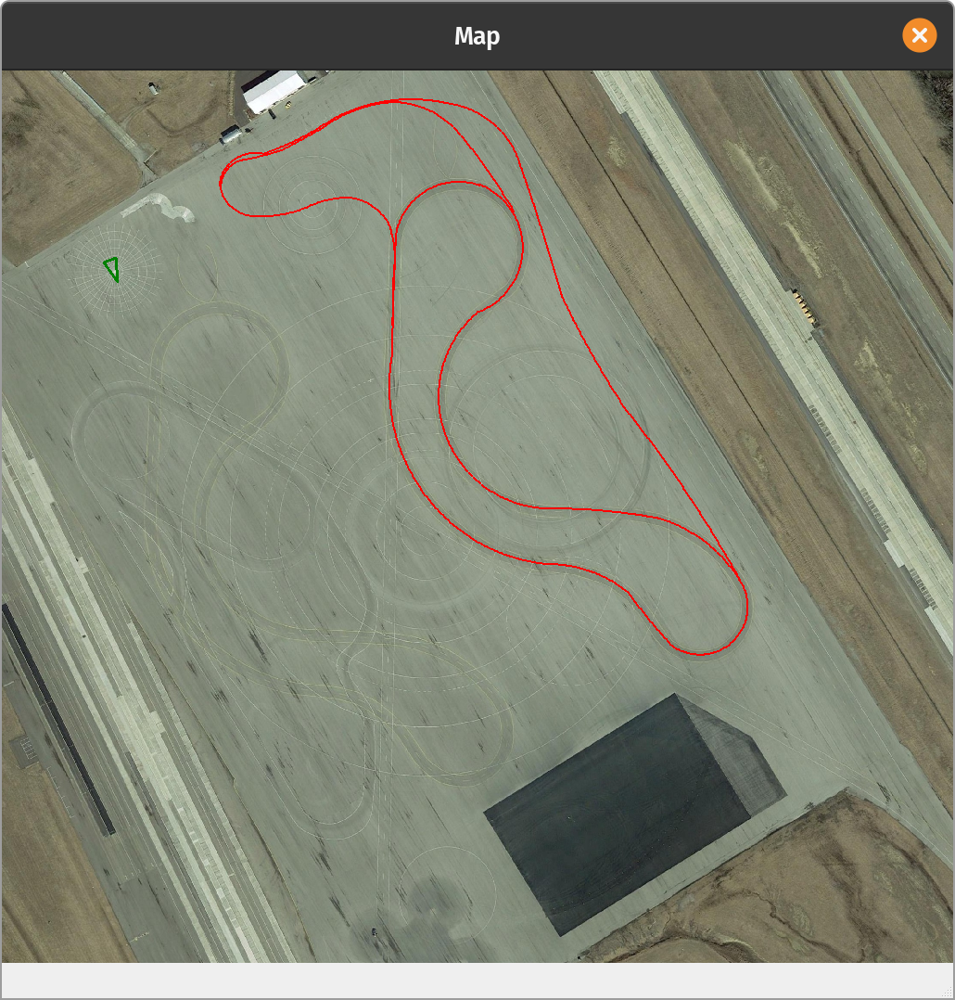

# Map Demo

This is a list of various styles of GUIs with some variations that were useful to know.

## 1. Main GUI

For code see ```gui_main.py```



* This GUI is simple with a button to open map in a separate window
* In the ```update()``` function lat, long and heading are supplied to the map window to plot on map
* In the example the values chosen are the same as calibration points of map just for easy confirmation
* The heading value is simply a variable incrementing by a degree each iteration just to show the vehicle triangle rotating. This is for testing only.

```bash
if self.mapOpen:
	self.mapWindow.draw_veh([40.308240, -83.546643, self.n])
```


## 2. Map Window


* 

* The purpose is to show how to import a plot window class (helps to open multiple separate plot windows)

* Uses plot_tools.py

For code see ```library_map.py```


